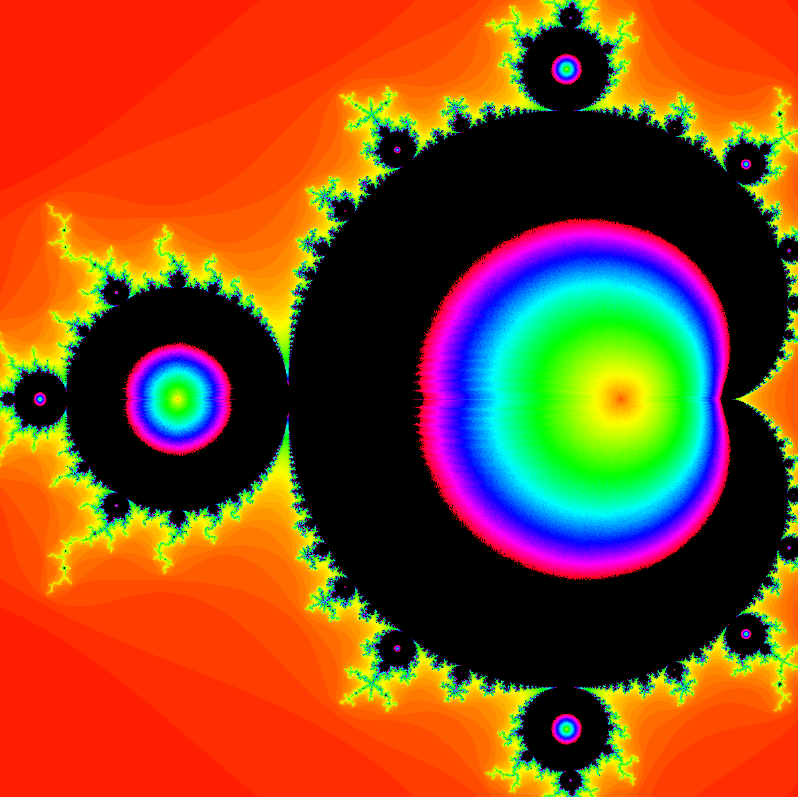

# Image documentation of the process

Starting resolution: 1200 by 1200
Starting max iteration: 1000 (I think)
Escape clause at this time was the iteration number at the point when the set repeats itself.
Colouring was determined by a linear map of escape iteration, 0, max iteration, 0 and 360 and then placed as the hue value in hsv with a modulus of black where max iteration was reached.
1. First render

2. Max 2000 iterations

3. Max 100 iterations

4. Escape clause was added for also escaping when `x*x + y*y > 2*2`

5. Modulus for max generations was removed

6. Max 200 iterations

7. Max 500 iterations

8. Max 1000 iterations

9. Optimisation: `if(newX == x && newY == y) break;` Modulus black colouring was also reintroduced

10. Max 100 iterations

11. Zoomed in on the edge of the set

12. Max 500 iterations and zoomed in more

13. Zoomed in MORE

14. Resolution: 1024 by 1024
Switched to cyclical colouring

15. Zoomed in more

16. Attempted optimisation of escape time algorithm

17. Tweaking

18. Tweaking
